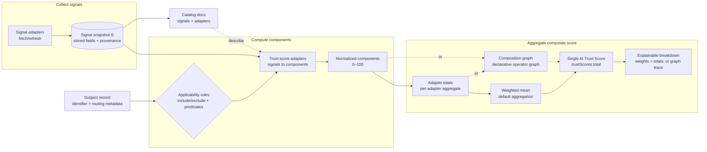
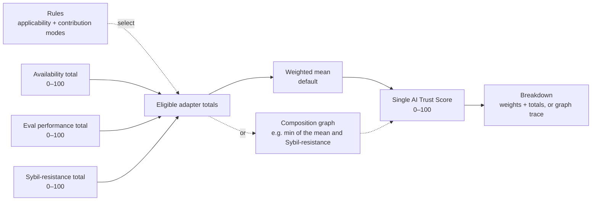

# HCS-25 Standard: AI Trust Score Methodology

### Status: Draft

### Version: 1.1

### Table of Contents

- [Authors](#authors)
  - [Primary Author](#primary-author)
  - [Additional Authors](#additional-authors)
- [Abstract](#abstract)
- [Motivation](#motivation)
- [Interpretation Guidance (Informative)](#interpretation-guidance-informative)
- [Terminology](#terminology)
- [Architecture Overview (Informative)](#architecture-overview-informative)
- [Adapter Types (Informative)](#adapter-types-informative)
- [Relationship to HCS-14 (Informative)](#relationship-to-hcs-14-informative)
- [Design Goals](#design-goals)
- [Specification](#specification)
  - [Scope](#scope)
  - [Inputs](#inputs)
  - [Trust Adapters](#trust-adapters)
    - [Applicability](#applicability)
    - [Contribution Modes](#contribution-modes)
    - [Weights](#weights)
  - [Trust Signals](#trust-signals)
    - [Signal Identifier Namespacing](#signal-identifier-namespacing)
    - [Signal Status Codes](#signal-status-codes)
    - [Signal Provenance](#signal-provenance)
    - [Signal Taxonomy (Informative)](#signal-taxonomy-informative)
  - [Normalization](#normalization)
    - [Component Keys](#component-keys)
    - [Score Range and Rounding](#score-range-and-rounding)
    - [Missing and Stale Data](#missing-and-stale-data)
    - [Recommended Normalization Patterns (Informative)](#recommended-normalization-patterns-informative)
  - [Aggregation](#aggregation)
    - [Adapter Total](#adapter-total)
    - [Composite AI Trust Score](#composite-ai-trust-score)
    - [Confidence (Optional)](#confidence-optional)
    - [Versioning](#versioning)
  - [Composition Graph (Optional)](#composition-graph-optional)
    - [Graph Configuration](#graph-configuration)
    - [Input References](#input-references)
    - [Operator Catalog](#operator-catalog)
    - [Availability and Status Propagation](#availability-and-status-propagation)
    - [Evaluation Order and Cycles](#evaluation-order-and-cycles)
    - [Composed Score](#composed-score)
    - [Explainability of Composed Scores](#explainability-of-composed-scores)
  - [Score Explanation (Optional)](#score-explanation-optional)
- [Rationale](#rationale)
- [Backwards Compatibility](#backwards-compatibility)
- [Security Considerations](#security-considerations)
- [Privacy Considerations](#privacy-considerations)
- [Test Vectors](#test-vectors)
- [Appendix A: Example Configuration (Informative)](#appendix-a-example-configuration-informative)
- [Future Work (Informative)](#future-work-informative)
- [Conformance](#conformance)
- [References](#references)
- [Governance Record (fill at publication)](#governance-record-fill-at-publication)
- [Changelog](#changelog)
- [License](#license)

## Authors

### Primary Author

- Michael Kantor [https://twitter.com/kantorcodes](https://twitter.com/kantorcodes)

### Additional Authors

- Tony Camero [https://github.com/tonycamero](https://github.com/tonycamero)
- Adethya Srinivasan [https://github.com/AdetsGithub](https://github.com/AdetsGithub)

## Abstract

This standard defines a platform-agnostic methodology for computing an **AI Trust Score** for an AI system (an “agent”, “model”, “tool”, or other AI endpoint), whether that system is exposed via a traditional web service, a marketplace, or a decentralized network. The methodology is based on:

1. collecting **trust signals** from one or more sources;
2. transforming signals into normalized **trust components** in the range **0–100** using deterministic **trust adapters**; and
3. computing a weighted **composite score** that is reproducible, explainable, and extensible.

This standard specifies the **algorithm** for normalization, missing-data handling, weighting, and aggregation. It does **not** mandate specific vendors, networks, registries, protocols, databases, refresh schedules, or caching layers.

## Motivation

AI systems are increasingly used as critical infrastructure. Consumers, integrators, and marketplaces need a simple, comparable way to understand trust-relevant properties such as:

- operational reliability (availability, latency);
- demonstrated capability (eval performance for scoped tasks);
- ecosystem signals (adoption, incident history);
- identity and accountability (operator provenance, attestations); and
- user feedback (quality, safety, helpfulness).

At the same time, trust is multi-dimensional. Single metrics are brittle and can be gamed. A composite score must therefore:

- remain explainable via a stable breakdown;
- support multiple signals without coupling to any one platform;
- allow signals to be excluded when inapplicable; and
- preserve forward compatibility as new trust metrics emerge.

## Interpretation Guidance (Informative)

This specification defines a **methodology for deriving scores**, not a canonical or portable reputation identity for a subject.

Implementations and consumers SHOULD interpret HCS-25 outputs as:

- **Context-bound**: a score reflects who is evaluating whom, under a specific configuration, signal snapshot, and use case.
- **Derived and versioned**: the output depends on adapter logic, weights, applicability rules, and scoring configuration version.
- **Decision support**: scores are informative inputs and SHOULD be used alongside additional controls (e.g., policy checks, provenance, manual review, or domain-specific safeguards).

Implementations MUST NOT treat an HCS-25 score as a sole authoritative basis for irreversible gating, enforcement, or exclusion decisions.

## Terminology

- **Subject**: The AI system being scored (e.g., agent, model, tool endpoint).
- **Trust Signal**: A raw measurement or observation used to inform scoring (e.g., uptime, benchmark result, repository popularity, response time).
- **Signal Snapshot**: The set of trust signals currently known for a subject at scoring time.
- **Signal Adapter**: A process that collects or refreshes trust signals for a subject and writes them into the subject’s signal snapshot.
- **Trust Score Adapter**: A deterministic scoring function that maps one or more signals into one or more normalized components.
- **Trust Adapter / Adapter**: Synonym for trust score adapter in this document.
- **Component**: A single normalized score (0–100) produced by a trust adapter (e.g., `availability.uptime`).
- **Adapter Total**: A per-adapter aggregate derived from that adapter’s component set.
- **Composite AI Trust Score**: The final score (0–100) computed from adapter totals with weights.
- **Applicability**: Whether a trust adapter is meaningful for a given subject (and thus eligible to contribute).
- **Contribution Mode**: An adapter policy describing whether the adapter participates in the composite denominator when it is applicable and/or when it produced output.
- **Denominator**: The set of adapter weights used in the composite weighted mean.
- **Registry**: An optional namespace representing the catalog or discovery domain that lists the subject. When the subject uses a UAID, this aligns with the `registry` parameter defined in HCS-14.
- **Protocol**: An optional transport or interoperability protocol used by the subject (e.g., HTTP-based, message-based, mailbox-based). When the subject uses a UAID, this aligns with the `proto` parameter defined in HCS-14.

Normative language such as **MUST**, **SHOULD**, and **MAY** is to be interpreted as in RFC 2119.

## Architecture Overview (Informative)



This diagram reflects the separation of **collection** (signal adapters) from **scoring** (trust score adapters) and the way applicability rules determine which adapters participate in the composite score.

Aggregation is a fork with one outcome. The default (solid path) combines adapter totals by a weighted mean. A configuration MAY instead define a composition graph (dashed path, [Composition Graph (Optional)](#composition-graph-optional)) — a declarative operator graph over adapter totals and components — in which case the weighted mean is not used. Either way the result is the same shape: a single AI Trust Score in `trustScores.total`, and an explainable breakdown of how it was reached.

### Composite score at a glance (Informative)



For a given subject, the composite score is computed as a weighted mean over the eligible adapter totals:

- Eligible set `E` is determined by applicability and contribution-mode rules.
- `score = round2( sum(w_i * total_i) / sum(w_i) )` for `i` in `E`.
- If the configuration defines a composition graph ([Composition Graph (Optional)](#composition-graph-optional)),
  `score` is instead the value of the composition graph's output node — for example
  `min(weighted_mean, sybil_resistance)`, so a weak Sybil-resistance signal caps the score rather
  than merely lowering the mean (Test Vector 4). The weighted mean is then not applied.

In both cases the outcome is a single trust score and a breakdown explaining it.

## Adapter Types (Informative)

This standard separates **collection** from **scoring**:

- **Signal adapters** collect raw data (signals). They are expected to perform I/O and may fail due to missing data, timeouts, or upstream errors.
- **Trust score adapters** compute normalized scores from signals. They are expected to be deterministic and inexpensive (CPU-bound).

One common pattern is:

1. A signal adapter fetches a provider’s raw data and stores a compact, versioned signal record (plus provenance).
2. A trust score adapter reads that signal record and emits one or more components in `[0,100]`.
3. The composite score aggregates adapter totals using weights and contribution modes.

This document intentionally does not mandate specific signal names. When publishing a concrete trust-score system, implementations SHOULD publish:

- a signal catalog (what is collected and in what shape), and
- an adapter catalog (how each adapter maps signals into components).

See:

- [Adapter catalog](./hcs-25/adapters/index.md) — index + per-adapter docs
- [Signal catalog](./hcs-25/signals/index.md) — index + per-signal docs (includes [Simple eval methodology](./hcs-25/signals/simple-evals.md))

Implementation note (informative): Hashgraph Online’s Registry Broker uses an HCS-25-style system in production. Public endpoints for inspection include:

- OpenAPI: `https://hol.org/registry/api/v1/openapi.json`
- Search: `https://hol.org/registry/api/v1/search`
- Agent record: `https://hol.org/registry/api/v1/agents/{uaid}`

## Relationship to HCS-14 (Informative)

HCS-25 defines a scoring methodology that can be applied to any identifier scheme. If an ecosystem already uses **UAIDs** as defined by **HCS-14**, implementations MAY reuse UAID routing parameters to drive HCS-25 applicability decisions:

- `registry` (HCS-14) can be treated as the subject’s **Registry** for adapter include/exclude lists.
- `proto` (HCS-14) can be treated as the subject’s **Protocol** for adapter applicability predicates.

This document does not require UAIDs, but it is designed to be compatible with UAID-based catalogs.

## Design Goals

1. **Platform-agnostic**: The methodology MUST be usable whether the subject is hosted on centralized infrastructure, decentralized infrastructure, or any hybrid deployment model.
2. **Explainability**: Implementations MUST be able to produce a stable breakdown of component scores used to compute the composite.
3. **Extensibility**: New signals and adapters MUST be introduced without breaking existing subjects, consumers, or stored data.
4. **Applicability-aware**: Inapplicable metrics MUST NOT distort the composite score.
5. **Reproducibility**: Given the same input snapshot and config version, the score computation MUST be deterministic.

## Specification

### Scope

This standard defines a scoring methodology for a **Subject**. Implementations MAY apply this methodology to any of the following subject classes:

- AI agent endpoints (interactive systems, tool agents, chat agents);
- model identifiers (hosted or self-hosted);
- protocol adapters (connectivity layers, routers);
- marketplaces/catalog entries; and
- composite entities representing multiple endpoints.

This standard defines **how to compute** scores, not how to store or transport them.

### Inputs

An implementation MUST compute a score from:

- a **Subject** record (at minimum: a stable identifier; optionally: registry, protocol, class);
- a **Signal Snapshot** `S`, representing the current known set of trust signals for the subject; and
- a **Scoring Configuration** `C`, defining adapter applicability, contribution modes, weights, and normalization functions.

`C` MUST be versioned (see [Versioning](#versioning)).

### Trust Adapters

A trust adapter is a deterministic scoring function that maps a signal snapshot to one or more normalized components.

Trust adapters MUST declare:

- a stable adapter identifier (`adapterId`);
- a component naming strategy (see [Component Keys](#component-keys));
- a default component key (`defaultComponentKey`) used when an applicable adapter contributes a deterministic `0` due to missing output (see [Contribution Modes](#contribution-modes));
- an applicability rule (see [Applicability](#applicability));
- a contribution mode (see [Contribution Modes](#contribution-modes));
- an optional weight (see [Weights](#weights)); and
- a normalization function for each component (see [Normalization](#normalization)).

#### Adapter Identifier Namespacing

Adapter identifiers MUST be stable, namespaced strings so that independently-defined adapters do not collide.

Conforming implementations MUST use a hyphen-separated namespace convention with the following pattern:

- `adapterId = segment *( "-" segment )`
- `segment = /[a-z][a-z0-9]*/`

Equivalent regular expression:

```
^[a-z][a-z0-9]*(?:-[a-z][a-z0-9]*)*$
```

Implementations SHOULD treat the first segment as a stable namespace when the adapter is ecosystem-specific (e.g., a marketplace or provider name).

Adapter identifiers MUST be unique within a given scoring configuration version.

#### Applicability

Trust adapters MUST support applicability constraints so that nonsensical metrics do not distort scores.

An adapter SHOULD support at least:

- `includeRegistries`: allow-list of registries where the adapter applies;
- `excludeRegistries`: deny-list of registries where the adapter never applies; and
- `appliesTo(subject)`: a predicate based on subject metadata (e.g., protocol, subject class).

If an adapter is not applicable to a subject, it MUST NOT contribute to the score, and MUST NOT be included in the composite denominator.

#### Contribution Modes

For each applicable adapter, an implementation MUST determine how it participates in the composite denominator. This standard defines three contribution modes:

- `universal`: included in the denominator for all applicable subjects; if the adapter produces no output for an applicable subject, it contributes a deterministic `0` using `defaultComponentKey`.
- `scoped`: included in the denominator only when it is applicable (as determined by applicability rules); if it is applicable but produces no output, it contributes a deterministic `0` using `defaultComponentKey`.
- `conditional` (default): included in the denominator only when it produces an output map (i.e., at least one component).

Implementations SHOULD use `universal` or `scoped` for in-scope requirements that should penalize missingness (e.g., protocol compliance checks). Implementations SHOULD use `conditional` for ecosystem-dependent signals that are sparse or unevenly available.

##### Default component key

Each adapter MUST define a `defaultComponentKey` that is a valid component key (see [Component Keys](#component-keys)).

It is used only when an adapter is applicable, the adapter’s contribution mode requires it to participate in the denominator, and the adapter would otherwise contribute an empty component map after applying the rules in [Missing and Stale Data](#missing-and-stale-data).

In that case, implementations MUST synthesize a single component with key `defaultComponentKey`, value `0`, and status `missing`.

If an adapter does not explicitly define `defaultComponentKey`, it MUST default to:

```text
{adapterId}.score
```

#### Weights

Each adapter MAY specify a non-negative weight `w(a) ≥ 0`. Weights MUST be treated as pure coefficients in a weighted mean (see [Composite AI Trust Score](#composite-ai-trust-score)).

If an adapter weight is not specified, it MUST default to `1`.

Adapters with `w(a) = 0` MUST NOT affect the score and SHOULD be treated as “informational only” (i.e., excluded from the denominator).

### Trust Signals

Trust signals are raw measurements collected from sources. This standard does not require any particular source, but it requires each signal to have:

- a stable **signal identifier**;
- a **status** indicating freshness/availability; and
- optional structured **provenance**.

#### Signal Identifier Namespacing

Signal identifiers MUST be stable, namespaced strings so that independently-defined signals do not collide.

Conforming implementations MUST use dot-separated namespaces with the following pattern:

- `signalId = segment "." segment *( "." segment )`
- `segment = /[a-z][a-z0-9_-]*/`

Equivalent regular expression:

```
^[a-z][a-z0-9_-]*(\\.[a-z][a-z0-9_-]*)+$
```

The first segment SHOULD identify a stable namespace such as:

- an ecosystem or routing namespace (e.g., `erc8004`, `agentverse`), and/or
- a provider or dataset (e.g., `openrouter`, `openlm`, `huggingface`), and/or
- a trust adapter identifier (recommended when practical).

Implementations MUST document their chosen namespaces in a published signal catalog.

#### Signal Status Codes

Signal adapters MUST assign one of the following status codes:

- `ok`: signal was collected successfully and is fresh.
- `missing`: no signal is available for this subject (e.g., source has no data).
- `timeout`: the source did not respond within the configured time budget.
- `error`: collection failed for any non-timeout reason.
- `stale`: a previously collected signal exists but is older than the implementation’s freshness policy.

Implementations MAY add more detailed status information but MUST be mappable to the above.

#### Signal Provenance

When available, a signal SHOULD include provenance, such as:

- source name and URL(s);
- subject identifier(s) used at the source;
- `fetchedAt` timestamp; and
- any aggregation parameters used during ingestion (e.g., timeframe, window).

#### Signal Taxonomy (Informative)

This standard intentionally does not enumerate a fixed required signal set. Implementations SHOULD consider a mix of signals across the following categories (non-exhaustive), to reduce brittleness and gaming:

- **Operational**: availability, latency, error rates, incident frequency, “last seen”, redundancy.
- **Security**: audit attestations, disclosed vulnerabilities, dependency risk, SBOM, abuse reports.
- **Capability / Quality**: scoped evals, protocol compliance checks, regression stability.
- **Safety / Policy**: refusal correctness, prompt-injection resilience, sandbox behavior, policy transparency.
- **Reputation / Adoption**: usage volume, ecosystem adoption, maintainer/org reputation, community engagement.
- **Feedback**: user ratings, verified feedback, dispute rates (with anti-sybil controls).
- **Transparency / Accountability**: documentation quality, changelog cadence, operator identity/attestation, contact/support channels.

### Normalization

#### Component Keys

Components MUST use stable string keys. Keys SHOULD use dot-separated namespaces:

```
{adapterId}.{componentName}
```

Examples:

- `availability.uptime`
- `reputation.stars`
- `evals.simple_math`

Component keys MUST NOT use whitespace and SHOULD be ASCII. Implementations SHOULD prefer lowercase.

The overall composite score MUST be included as `trustScores.total`.

#### Score Range and Rounding

All component scores MUST be normalized to the range **0–100** inclusive.

Implementations MUST:

- clamp component values into `[0,100]`;
- compute totals using finite numeric arithmetic; and
- round values to a stable precision (RECOMMENDED: 2 decimals).

#### Missing and Stale Data

For a given adapter component `k`, let the adapter’s normalization function be `normalize_k(S, subject, C)`.

The output of `normalize_k` MUST be a tuple:

- `value` (number in `[0,100]`); and
- `status` (one of the signal status codes).

An implementation MUST apply the following rules:

1. If a component’s status is `ok`, its `value` MUST be used as-is.
2. If a component’s status is `stale`, its `value` MUST be multiplied by a **staleness multiplier** `m_stale ∈ [0,1]`. If `m_stale` is not configured, it MUST default to `1`.
3. If a component’s status is `missing`, `timeout`, or `error`, its `value` MUST be `0`, unless the adapter explicitly specifies that the component is **non-scorable** when unavailable.

If a component is non-scorable when unavailable, it MUST be omitted from the adapter’s component set for aggregation, and MUST be reported as unavailable in the breakdown.

##### Declaring non-scorable components

An adapter MAY declare, using an implementation-defined component definition, that a component is non-scorable when unavailable.

For example, an implementation MAY represent this with a boolean flag such as:

- `nonScorableWhenUnavailable: true`

If no such declaration is present, the component MUST be treated as scorable when unavailable.

Declaring a component as non-scorable when unavailable does not exempt an applicable adapter from denominator participation when its contribution mode requires participation. If that adapter would otherwise contribute an empty component map, implementations MUST apply `defaultComponentKey` as defined above.

#### Recommended Normalization Patterns (Informative)

Implementations SHOULD prefer monotonic transforms that are robust to outliers and hard to game. Common patterns include:

- **Bounded ratio**: for `x ∈ [0,1]`, `score = 100 * x`.
- **Thresholded step**: score 0 below a minimum threshold, then linear up to a cap.
- **Log scaling**: for counts (stars/downloads), `score = 100 * clamp(log(1+x)/log(1+cap), 0, 1)`.
- **Sigmoid scaling**: for unbounded scores (Elo-like), `score = 100 * sigmoid((x - μ)/s)`, where `μ` and `s` are chosen per snapshot/config.
- **Rank-based scaling**: map percentile rank to `[0,100]`, optionally with a concave curve to emphasize top ranks.

### Aggregation

#### Adapter Total

For a given adapter `a` and subject:

- Let `K_a` be the set of components produced by `a` after applying non-scorable omission (see [Missing and Stale Data](#missing-and-stale-data)).
- If `K_a` is empty, the adapter total `total(a)` MUST be `0`.
- Otherwise, the adapter total MUST be the arithmetic mean:

```
total(a) = (Σ value(k)) / |K_a|
```

An adapter MAY specify a custom within-adapter aggregation (e.g., component weights), but it MUST be deterministic, MUST remain in the range `[0,100]`, and MUST be explainable using the emitted component breakdown.

#### Composite AI Trust Score

The composite AI Trust Score MUST be computed as a weighted mean of adapter totals over the set of adapters included in the denominator.

- Let `A_applicable` be the set of adapters applicable to the subject (see [Applicability](#applicability)).
- Let `A_denominator` be the subset of `A_applicable` included by contribution mode:
  - if `contributionMode(a) = universal`, then `a ∈ A_denominator`;
  - if `contributionMode(a) = scoped`, then `a ∈ A_denominator`;
  - if `contributionMode(a) = conditional`, then `a ∈ A_denominator` iff `a` produced a non-empty component map.
- For each `a ∈ A_denominator`, let `total(a)` be its adapter total (0–100) and `w(a) ≥ 0` be its weight.

Then:

```
trustScore = (Σ (total(a) * w(a))) / (Σ w(a))
```

If `A_denominator` is empty, `trustScore` MUST be `0`.

The composite score MUST be stored as `trustScores.total`. Implementations MAY also mirror it to a top-level `trustScore`.

#### Confidence (Optional)

Implementations MAY compute an additional `trustConfidence` value in `[0,1]` to communicate uncertainty due to missingness and staleness.

If present, a conforming implementation SHOULD compute confidence deterministically from the same inputs as the score. One RECOMMENDED approach is:

```
trustConfidence = (Σ (w(a) * c(a))) / (Σ w(a))
```

Where `c(a) ∈ [0,1]` is an adapter confidence derived from:

- fraction of `ok` components vs missing/unavailable; and
- freshness of signal provenance (`fetchedAt`) if present.

Confidence MUST NOT be used to alter the numeric trust score unless explicitly specified in configuration, and MUST be reported separately from `trustScores.total`.

#### Versioning

Implementations MUST version their scoring configuration using a monotonically increasing `trustScoreConfigVersion`.

The score record MUST include:

- `trustScoreUpdatedAt` (timestamp); and
- `trustScoreConfigVersion` (integer).

If an implementation changes normalization functions, adapter weights, applicability rules, contribution modes, component definitions, or the composition graph defined in [Composition Graph (Optional)](#composition-graph-optional), it MUST increment `trustScoreConfigVersion`.

Implementations SHOULD preserve the ability to recompute historical trust scores for a given version when possible.

### Composition Graph (Optional)

[Composite AI Trust Score](#composite-ai-trust-score) defines exactly one way to combine
adapter totals: a weighted mean. That is sufficient to express *how much* a dimension
matters, but not *whether a dimension governs* — a policy such as "if a safety dimension
falls below a floor, cap the composite regardless of the other dimensions" cannot be
written as a coefficient.

This section defines an OPTIONAL **composition graph** that expresses such policies as
declarative, portable configuration. The terms are distinct: the *composite* is the
resulting score; a *composition graph* is the mechanism that may produce it in place of the
default weighted mean.

**If a scoring configuration does not define a composition graph, the composite AI Trust Score
is exactly as defined in [Composite AI Trust Score](#composite-ai-trust-score), and this
section imposes no requirements.** An implementation MAY decline to support composition graphs
and remain conformant with this standard.

This standard does not specify who authors a scoring configuration. A composition graph MAY be
fixed by the implementation producing scores, selected by a consumer from a set the
implementation publishes, or authored by a consumer that applies this methodology to
published adapter outputs. In every case the resulting score is governed by the
configuration that produced it, and the comparability rule in
[Backwards Compatibility](#backwards-compatibility) applies unchanged.

#### Graph Configuration

A scoring configuration `C` MAY include a **composition graph**: a directed acyclic graph of
named nodes, each applying one operator to an ordered list of inputs, with one node
designated as the graph's **output**.

A composition graph MUST declare:

- a set of uniquely named nodes;
- for each node, an operator from the [Operator Catalog](#operator-catalog), an ordered
  list of input references, and any parameters that operator requires; and
- the name of the output node.

#### Input References

Each node input MUST be a reference of one of the following forms:

- `adapter:{adapterId}` — the adapter total of `a`, as defined in
  [Adapter Total](#adapter-total). If `a` is not in `A_denominator`, the reference is
  **unavailable**.
- `component:{componentKey}` — a single normalized component value, after the rules in
  [Missing and Stale Data](#missing-and-stale-data) have been applied. If the component
  was omitted as non-scorable, or was not emitted, the reference is **unavailable**.
- `node:{nodeName}` — the value of another node in the same composition graph.

A reference to an adapter, component, or node that is not defined in the scoring
configuration MUST be rejected as a configuration error.

Referencing a component does not remove it from its adapter's total. An adapter that
intends a component to serve as a governance input rather than a measured dimension
SHOULD exclude it using the custom within-adapter aggregation permitted by
[Adapter Total](#adapter-total), so the component is not counted twice.

#### Operator Catalog

Every operator MUST be deterministic, MUST depend only on its inputs and declared
parameters, and MUST return a value in `[0,100]` rounded per
[Score Range and Rounding](#score-range-and-rounding).

Let `V = [v₁ … vₙ]` be the values of a node's **available** inputs, in declaration order.

| Operator | Parameters | Result |
| --- | --- | --- |
| `weightedMean` | `weights` `[w₁ … wₙ]`, `wᵢ ≥ 0` | `Σ(vᵢ · wᵢ) / Σwᵢ` |
| `mean` | — | `Σvᵢ / n` |
| `min` | — | `min(V)` |
| `max` | — | `max(V)` |
| `median` | — | middle value of sorted `V`; mean of the two middle values when `n` is even |
| `floor` | — | `min(v₁, v₂)`, where `v₁` is the primary input and `v₂` the floor |
| `gate` | `below`, `cap` | `v₂ < below ? min(v₁, cap) : v₁`, where `v₁` is the primary input and `v₂` the condition |
| `constant` | `value` | `value` |

For `weightedMean`, if `Σwᵢ = 0` the node is **unavailable**.

`floor` and `gate` are ordered, two-input operators: the first input is the primary value
being governed, the second is the floor or condition. Implementations MUST NOT reorder
their inputs.

Implementations MAY define additional operators. Any additional operator MUST satisfy the
determinism and range requirements above, and MUST be declared in the published
configuration; a composition graph using an operator the evaluating implementation does not
recognize MUST be rejected as a configuration error rather than silently ignored.

#### Availability and Status Propagation

Composition Graph MUST preserve the distinction between "measured as low" and "not measured",
consistent with [Missing and Stale Data](#missing-and-stale-data).

1. An unavailable input MUST be omitted from a node's input list. It MUST NOT be coerced
   to `0`.
2. For `min`, `max`, `mean`, `median` and `weightedMean`, if every input is unavailable
   the node is unavailable.
3. For `floor` and `gate`, if the primary input is unavailable the node is unavailable.
   If the floor or condition input is unavailable, the node's value MUST be the primary
   input unchanged, and the node MUST be reported as having applied no constraint. A
   missing safety signal MUST NOT silently impose a cap, and MUST NOT silently remove one.
4. A node's status MUST be the most severe status among its contributing inputs, using the
   codes in [Signal Status Codes](#signal-status-codes) and the ordering
   `ok` < `stale` < {`missing`, `timeout`, `error`}.

The staleness multiplier defined in [Missing and Stale Data](#missing-and-stale-data) is
applied during normalization, before the composition graph is evaluated. The composition
graph MUST NOT apply it a second time.

#### Evaluation Order and Cycles

A composition graph MUST be acyclic. Implementations MUST reject a composition graph containing a
cycle as a configuration error, and MUST NOT attempt to resolve one.

Nodes MUST be evaluated in a topological order of their input references. Where several
orders satisfy that constraint, an implementation MUST choose deterministically, so that
the same configuration and signal snapshot always produce the same result and the same
breakdown.

#### Composed Score

When a scoring configuration defines a composition graph, the value of the output node MUST be
stored as `trustScores.total`, in place of the value defined in
[Composite AI Trust Score](#composite-ai-trust-score).

If the output node is unavailable, `trustScores.total` MUST be the value defined in
[Composite AI Trust Score](#composite-ai-trust-score), and the composition graph MUST be
reported as unavailable. A composition graph that cannot be evaluated MUST NOT produce a score
of `0`.

When a composition graph has been applied, the score record MUST identify it, so that a score
can be traced to the policy that produced it. Implementations MUST include a stable
composition graph identifier alongside `trustScoreConfigVersion`; the identifier MUST change
whenever the composition graph changes.

##### Reproduction of the composite (normative)

A composition graph consisting of a single `weightedMean` node, whose inputs are
`adapter:{adapterId}` for every adapter in `A_denominator` with those adapters' weights
`w(a)`, MUST produce a value equal to the composite defined in
[Composite AI Trust Score](#composite-ai-trust-score).

The aggregation defined by this standard is therefore the one-node special case of a
composition graph, and any conforming implementation can verify that supporting composition graphs
does not alter the standard's existing behaviour.

#### Explainability of Composed Scores

[Design Goals](#design-goals) requires implementations to be able to produce a stable
breakdown of the components used to compute a composite. Where a composition graph is applied,
that breakdown MUST extend to the composition graph, and an implementation MUST be able to
produce, for each node: its name, operator, parameters, resolved inputs with their values
and availability, its resulting value, and its status.

A composition graph whose effect on a score cannot be inspected offers no advantage over the
same policy implemented inside an adapter, and defeats the purpose of this section.

### Score Explanation (Optional)

[Design Goals](#design-goals) requires that an implementation be *able* to produce a
stable breakdown, but this standard does not otherwise define how a breakdown is
expressed. In practice a consumer holding a score has two handles on how it was derived:
the number itself and `trustScoreConfigVersion`. Adapter weights, denominator membership,
component statuses and any composition graph are not observable, so a consumer cannot reproduce
a published score, and cannot tell whether two scores differ because a subject changed or
because the configuration did.

Implementations MAY therefore publish a **score explanation** alongside a score record.
Publication is OPTIONAL; the requirements below apply only to implementations that choose
to publish one.

A published score explanation MUST be sufficient to recompute `trustScores.total` by
applying the rules of this document, and MUST include:

- `trustScoreConfigVersion`, and the composition graph identifier if a composition graph was applied;
- for every adapter in `A_applicable`:
  - its `adapterId`, contribution mode, weight `w(a)`, and whether it is in
    `A_denominator`;
  - its adapter total; and
  - its components, each with key, value, and status — including components omitted as
    non-scorable, which MUST be marked unavailable rather than reported as `0`; and
- if a composition graph was applied, each node's name, operator, parameters, inputs, resulting
  value, and status.

An implementation publishing a score explanation MUST ensure that a consumer applying this
document to that explanation reproduces `trustScores.total` exactly, subject only to the
rounding defined in [Score Range and Rounding](#score-range-and-rounding). This is a
testable property and implementations SHOULD verify it as part of their test suite.

A score explanation describes how a score was computed. It does not make the score
authoritative, and per [Security Considerations](#security-considerations) it does not
change the guidance that trust scores should not be the sole basis for irreversible
decisions.

## Rationale

This methodology separates:

- **signal collection** (heterogeneous and potentially expensive) from
- **score computation** (deterministic and explainable).

The contribution modes plus component non-scorable omission lets ecosystems choose between:

- penalizing missingness for in-scope requirements (`always` + missing→0); and
- avoiding bias against subjects where a signal is structurally unavailable (`onlyWhenPresent` and/or omit non-scorable components).

Composition Graph is kept separate from weights because the two express different things. A
weight says how much a dimension counts; it can only ever dilute. Some policies are not
matters of degree: "a subject attested by a single source cannot be treated as highly
trusted" is a constraint, not a coefficient, and raising a weight to approximate it
penalizes every subject in the population instead of the ones that fail the condition.
Expressing such a rule as a coefficient also destroys the information a consumer needs to
audit it — the resulting score carries no record that a constraint existed.

Composition Graph is defined as configuration rather than as adapter behaviour for the same
reason. An adapter that embeds one deployment's policy is no longer portable to another,
and its score becomes unexplainable outside the implementation that produced it. Keeping
composition graph in `C` preserves adapter reuse and keeps the policy inspectable.

The layer is optional because most implementations do not need it, and because a standard
that forced every existing implementation to adopt a graph model in order to remain
conformant would be a poor trade for a capability many will never use.

## Backwards Compatibility

This standard is additive and configuration-versioned. Consumers MUST NOT assume two trust scores are comparable unless they share the same `trustScoreConfigVersion` (or the implementation declares compatibility between versions).

Implementations SHOULD provide access to the configuration version alongside any displayed trust score.

The composition graph added in version 1.1 is additive and OPTIONAL. An implementation
conformant with version 1.0 remains conformant with version 1.1 without modification, and
every score it produces is unchanged:

- a scoring configuration that defines no composition graph is evaluated exactly as in version
  1.0;
- no existing required output field changes meaning for such a configuration; and
- support for composition graphs is OPTIONAL (see [Conformance](#conformance)).

Where a composition graph *is* configured, `trustScores.total` carries the composed value, and
that configuration MUST carry a new `trustScoreConfigVersion` — so the existing rule that
scores are comparable only within a configuration version already covers the change. A
consumer that has not observed the version change is not exposed to a silently
re-derived score.

## Security Considerations

Trust scores can be gamed. Implementations SHOULD consider:

- Sybil resistance for reputation and feedback signals.
- Limits and validation for all external signal inputs.
- Auditability of configuration changes (configuration version bumps SHOULD be logged).
- Attestation mechanisms (e.g., signed signal snapshots, verifiable credentials) when trust scores drive high-stakes decisions.
- Bounds on graph size, node count, and depth where a composition graph may be supplied by an untrusted party, since evaluation cost grows with the graph.
- That a composition graph can only constrain or re-combine values the adapters already produced; it cannot manufacture trust that the signals do not support, and it is not a substitute for the Sybil resistance and input validation above.

## Privacy Considerations

Trust scoring may involve:

- user feedback and session metadata;
- account identifiers and operator identities; and
- network telemetry (latency, availability).

Implementations SHOULD:

- avoid storing raw user identifiers when aggregated metrics suffice;
- publish only aggregated signal outputs where possible; and
- document retention policies for trust signals.

## Test Vectors

The following test vectors are illustrative and intended to validate deterministic computation and missing-data behavior.

### Test Vector 1: Missingness Penalized (Scoped Contribution)

**Configuration (C):**

- Adapters (all applicable) use `contributionMode: scoped`:
  - `availability` (`weight = 1`), components: `availability.uptime`
  - `simple_evals` (`weight = 2`), components: `simple_evals.math`, `simple_evals.science`
  - `reputation` (`weight = 1`), components: `reputation.stars`
- Stale multiplier: `m_stale = 1`

**Snapshot (S) produces components (already normalized):**

- `availability.uptime = 90` (`ok`)
- `simple_evals.math = 100` (`ok`)
- `simple_evals.science` is `missing` → value `0`
- `reputation.stars = 40` (`ok`)

**Adapter totals:**

- `total(availability) = 90`
- `total(simple_evals) = (100 + 0) / 2 = 50`
- `total(reputation) = 40`

**Composite:**

```
trustScore = (90*1 + 50*2 + 40*1) / (1 + 2 + 1)
           = (90 + 100 + 40) / 4
           = 57.5
```

### Test Vector 2: Sparse Signals Do Not Bias (Conditional Contribution)

Same as Test Vector 1, except `reputation` uses `contributionMode: conditional` and produces no output:

- `reputation.stars` is `missing` → adapter returns no component map

Then `reputation` is excluded from the denominator and:

- `trustScore = (90*1 + 50*2) / (1 + 2) = 63.33…` → `63.33` (rounded to 2 decimals).

### Test Vector 3: A Composition Graph Reproduces the Composite (Parity)

Same configuration and snapshot as Test Vector 1, with a composition graph added:

- node `all`: `weightedMean`, inputs `adapter:availability`, `adapter:simple_evals`,
  `adapter:reputation`, weights `[1, 2, 1]`
- output: `all`

```
value(all) = (90*1 + 50*2 + 40*1) / (1 + 2 + 1) = 57.5
```

`trustScores.total = 57.5`, identical to Test Vector 1. A single `weightedMean` node over
the denominator adapters reproduces [Composite AI Trust Score](#composite-ai-trust-score)
exactly, as required by
[Reproduction of the composite](#reproduction-of-the-composite-normative).

### Test Vector 4: Safety Floor (a Dimension Governs Rather Than Dilutes)

**Configuration (C):** four adapters, `contributionMode: scoped`, all `weight = 1`:
`availability`, `performance`, `reputation`, `sybil-resistance`.

**Adapter totals:** `availability = 90`, `performance = 80`, `reputation = 61`,
`sybil-resistance = 24`.

Without a composition graph:

```
trustScore = (90 + 80 + 61 + 24) / 4 = 63.75
```

**Composition Graph:**

- node `quality`: `weightedMean`, inputs `adapter:availability`, `adapter:performance`,
  `adapter:reputation`, weights `[1, 1, 1]`
- node `governed`: `floor`, inputs `node:quality`, `adapter:sybil-resistance`
- output: `governed`

```
value(quality)  = (90 + 80 + 61) / 3 = 77
value(governed) = min(77, 24)        = 24
```

`trustScores.total = 24`.

The contrast is the point. As a fourth term in the mean, a weak Sybil-resistance signal
moves the score from `77` to `63.75`. As a floor, it governs: the composite cannot exceed
the dimension the configuration declares to be limiting.

### Test Vector 5: Gate With a Stale, Then Unavailable, Condition

**Configuration (C):** `m_stale = 0.8`; adapters `quality` and `corroboration`, both
`contributionMode: conditional`, `weight = 1`.

**Case (a) — condition is stale.**

- `quality.score = 90` (`ok`) → `total(quality) = 90`
- `corroboration.sources = 50` (`stale`) → effective value `50 * 0.8 = 40` →
  `total(corroboration) = 40`

Without a composition graph: `trustScore = (90 + 40) / 2 = 65`.

**Composition Graph:**

- node `governed`: `gate`, inputs `adapter:quality`, `component:corroboration.sources`,
  `below = 50`, `cap = 70`
- output: `governed`

```
condition = 40   (staleness already applied during normalization)
40 < 50          → value(governed) = min(90, 70) = 70
```

`trustScores.total = 70`, and `status(governed) = stale`, being the most severe status
among its contributing inputs. The staleness multiplier is applied once, during
normalization, and MUST NOT be applied again by the composition graph.

**Case (b) — condition is unavailable.** `corroboration` declares
`corroboration.sources` non-scorable when unavailable and emits no component, so the
adapter is excluded from the denominator and `component:corroboration.sources` is
unavailable.

```
value(governed) = 90   (primary passes through; no constraint applied)
```

A missing safety signal neither imposes nor removes a cap.

## Conformance

An implementation is conformant with HCS-25 if it satisfies all MUST-level requirements in this document, including:

- normalizes all component values to `[0,100]` with stable rounding;
- supports the defined signal status codes and applies missing/stale rules as specified;
- enforces adapter applicability and denominator policies as specified;
- computes adapter totals and composite trust score as specified; and
- emits `trustScores.total` plus `trustScoreUpdatedAt` and `trustScoreConfigVersion`.

[Composition Graph (Optional)](#composition-graph-optional) and
[Score Explanation (Optional)](#score-explanation-optional) are OPTIONAL to support. An
implementation that supports neither is conformant. An implementation that supports
composition graph MUST additionally:

- treat a configuration without a composition graph exactly as specified in
  [Composite AI Trust Score](#composite-ai-trust-score);
- implement the operators it declares with the semantics given in the
  [Operator Catalog](#operator-catalog);
- omit unavailable inputs rather than coercing them to `0`, and propagate status as
  specified in
  [Availability and Status Propagation](#availability-and-status-propagation);
- reject cyclic compositions and unresolvable references as configuration errors;
- evaluate nodes in a deterministic topological order;
- satisfy
  [Reproduction of the composite](#reproduction-of-the-composite-normative); and
- identify the applied composition graph in the score record.

An implementation that publishes a score explanation MUST ensure it is sufficient to
reproduce `trustScores.total` as specified in
[Score Explanation (Optional)](#score-explanation-optional).

## References

- RFC 2119: Key words for use in RFCs to Indicate Requirement Levels
- RFC 8174: Ambiguity of Uppercase vs Lowercase in RFC 2119 Key Words
- HCS-14: Universal Agent ID Standard (`./hcs-14.md`) (informative)
- NIST AI Risk Management Framework (AI RMF 1.0) (informative)
- W3C Verifiable Credentials Data Model (informative)

## Appendix A: Example Configuration (Informative)

This appendix provides an **example configuration** to make the abstract parts of HCS-25 concrete. It is **informative only** and does not constrain conforming HCS-25 implementations.

### A.1 Example adapter set

| Adapter ID | Contribution mode | Suggested weight | Typical applicability |
| --- | --- | --- | --- |
| [`availability`](./hcs-25/adapters/availability.md) | `universal` | `1` | Runtime endpoints where “reachable” is meaningful |
| [`ethos`](./hcs-25/adapters/ethos.md) | `universal` | `1` | Ecosystems with a credible third-party reputation source |
| [`acp`](./hcs-25/adapters/acp.md) | `scoped` | `2` | ACP/Virtuals-style marketplaces (job performance + rating) |
| [`erc8004-feedback`](./hcs-25/adapters/erc8004-feedback.md) | `scoped` | `1` | ERC-8004-style marketplaces (rating + volume) |
| [`x402`](./hcs-25/adapters/x402.md) | `scoped` | `1` | Payment-backed services (volume + trades) |
| [`oss-popularity`](./hcs-25/adapters/oss-popularity.md) | `scoped` | `0.7` | OSS artifacts (stars + downloads) |
| [`simple-math`](./hcs-25/adapters/simple-math.md) | `scoped` | `0.5` | Interactive agents/models where baseline correctness is expected |
| [`simple-science`](./hcs-25/adapters/simple-science.md) | `scoped` | `0.5` | Interactive agents/models where baseline correctness is expected |
| [`agentverse-insights`](./hcs-25/adapters/agentverse-insights.md) | `scoped` | `1` | Marketplaces exposing “insights”/quality metadata |
| [`agentverse-verifier`](./hcs-25/adapters/agentverse-verifier.md) | `conditional` | `1` | Marketplaces exposing verifier counters (only when present) |
| [`connectivity`](./hcs-25/adapters/connectivity.md) | `conditional` | `1` | Optional independent connectivity probes (implementation-specific) |
| [`openrouter-evals`](./hcs-25/adapters/openrouter-evals.md) | `scoped` | `0.5` | Model catalogs with provider-defined benchmark/ranking signals |
| [`chatbot-arena`](./hcs-25/adapters/chatbot-arena.md) | `scoped` | `6` | Preference leaderboards (high weight if primary ranking signal) |
| [`huggingface-model-index`](./hcs-25/adapters/huggingface-model-index.md) | `conditional` | `0.8` | Model-index/popularity sources (only when coverage exists) |
| [`openllm-leaderboard`](./hcs-25/adapters/openllm-leaderboard.md) | `conditional` | `1` | Open benchmark leaderboards (only when coverage exists) |
| [`model-tier`](./hcs-25/adapters/model-tier.md) | `conditional` | `2` | Fallback heuristic for sparse external-eval coverage |

### A.2 Example signal adapter set

An example collection layer that can support the adapter set above includes signal adapters for:

- feedback summaries (e.g., average rating + count);
- third-party reputation (e.g., Ethos-style);
- usage volume/trade counts (e.g., x402-style);
- OSS popularity (e.g., GitHub stars and package downloads);
- model leaderboards (e.g., preference leaderboards and benchmark tables); and
- SimpleMath/SimpleScience eval results (see [Simple eval methodology](./hcs-25/signals/simple-evals.md)).

## Future Work (Informative)

Implementations SHOULD publish ecosystem-specific extensions to the HCS-25 catalogs when they introduce new signals, naming conventions, or applicability rules.

Next: Optionally expand the signal catalog with more ecosystem-specific signal schemas and mapping tables.

## Governance Record (fill at publication)

- Poll topic: `hcs://8/<topicId>` (or Mirror Node link)
- Outcome: PASS | FAIL on YYYY-MM-DD (UTC)
- Reference: (txn id or final tally link)

## Changelog

| Version | Date      | Description |
| ------- | --------- | ----------- |
| 1.1     | (pending) | Added the OPTIONAL [Composition Graph](#composition-graph-optional): operator catalog, acyclic graph model, availability and status propagation, deterministic evaluation order, and a normative requirement that a one-node `weightedMean` composition graph reproduce the existing composite. Added the OPTIONAL [Score Explanation](#score-explanation-optional). Added Test Vectors 3–5. Updated the Architecture Overview and Composite-score-at-a-glance diagrams to show composition graph as an optional path beside the default weighted mean. Additive only: a configuration that defines no composition graph is evaluated exactly as in 1.0, and support for both sections is OPTIONAL. |
| 1.0     | —         | Initial draft. |

## License

This document is licensed under Apache-2.0.
